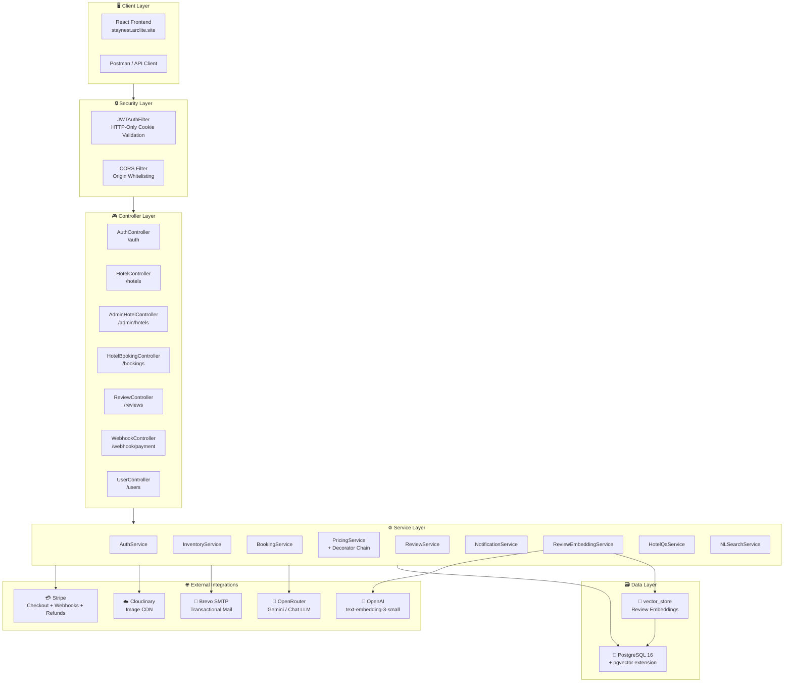
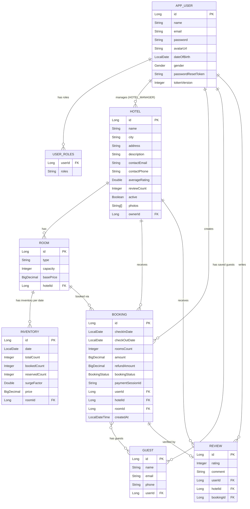
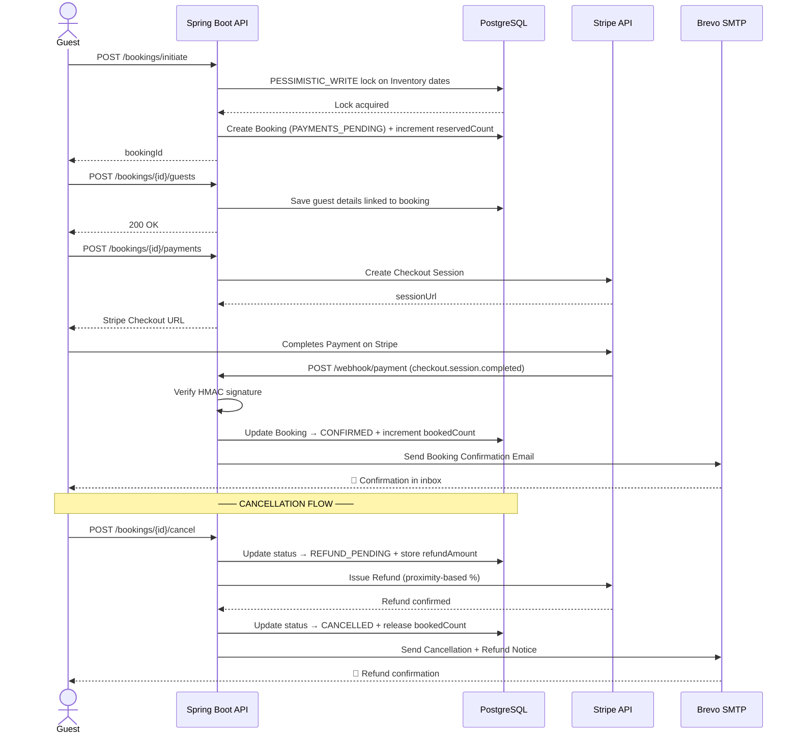
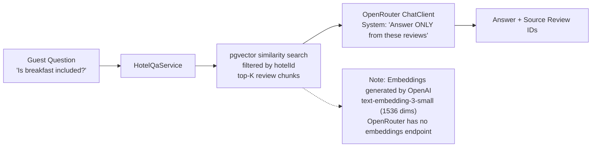
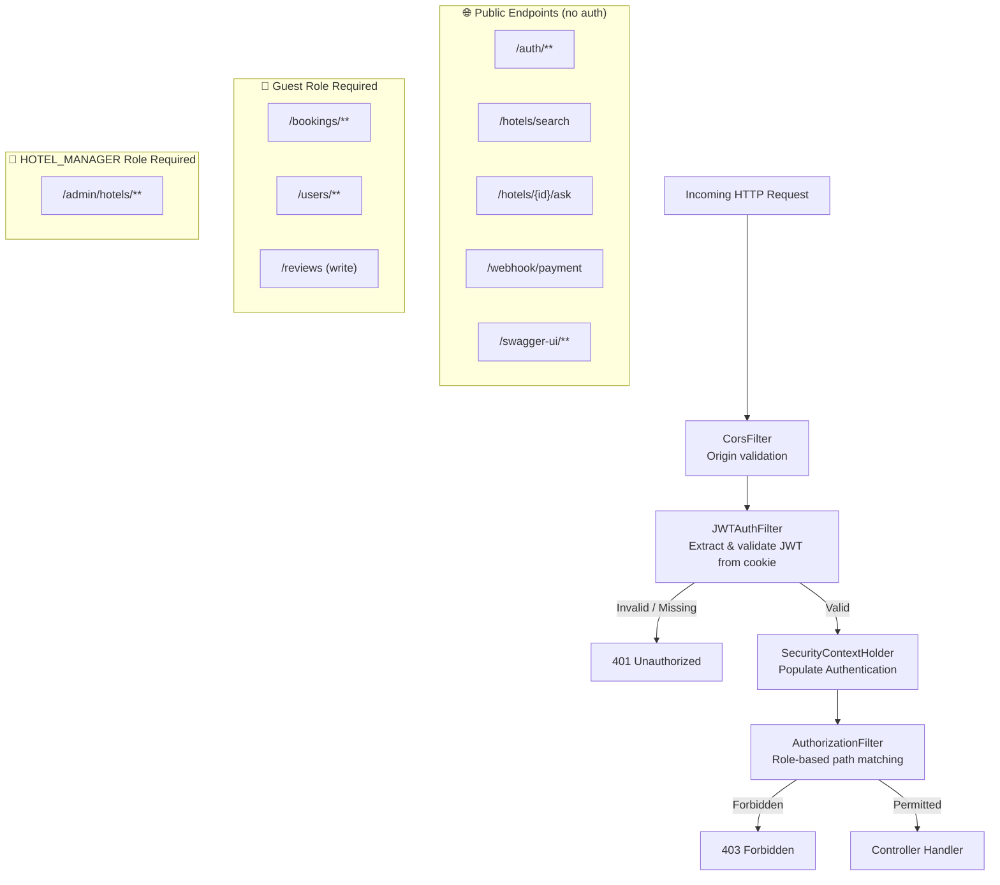

<div align="center">

# 🏨 StayNest Backend

### *Production-Grade Hotel Booking Platform — Built with Spring Boot & Java 21*

[](https://openjdk.org/)
[](https://spring.io/projects/spring-boot)
[](https://postgresql.org/)
[](https://stripe.com/)
[](https://cloudinary.com/)
[](LICENSE)

<br/>

> **StayNest** is a feature-rich, production-ready hotel booking backend powering guest bookings, hotel management, dynamic AI-driven pricing, transactional payments with Stripe, media storage with Cloudinary, and retrieval-augmented review Q&A — all from a single cohesive Spring Boot application.

[🚀 Live API](#-api-reference) · [⚡ Quick Start](#-quick-start) · [🏗 Architecture](#-system-architecture) · [🤖 AI Features](#-ai--llm-features)

</div>

---

## 📋 Table of Contents

- [✨ Feature Highlights](#-feature-highlights)
- [🏗 System Architecture](#-system-architecture)
- [🗃 Database Schema](#-database-schema)
- [💰 Dynamic Pricing Engine](#-dynamic-pricing-engine)
- [📦 Tech Stack](#-tech-stack)
- [⚡ Quick Start](#-quick-start)
- [🔧 Environment Variables](#-environment-variables)
- [📡 API Reference](#-api-reference)
- [🔄 Booking Lifecycle](#-booking-lifecycle)
- [🤖 AI & LLM Features](#-ai--llm-features)
- [🛡 Security Model](#-security-model)
- [🚨 Error Handling](#-error-handling)
- [📦 Project Structure](#-project-structure)
- [🧪 Testing](#-testing)
- [⚠️ Known Limitations](#️-known-limitations)

---

## ✨ Feature Highlights

| Feature | Description |
|---|---|
| 🔐 **JWT Auth** | Stateless, HTTP-only cookie based authentication with role-based access control |
| 💳 **Stripe Payments** | Full checkout session creation, webhook reconciliation & automated refunds |
| 📈 **Dynamic Pricing** | Decorator-pattern pricing engine with occupancy, urgency, surge, holiday, and AI multipliers |
| 🤖 **AI Pricing (opt-in)** | OpenRouter/Gemini driven rate adjustments clamped to `[0.8x – 1.3x]` |
| 💬 **NL Search (opt-in)** | Converts free-text guest queries to structured hotel searches via LLM extraction |
| 📝 **RAG Review Q&A (opt-in)** | pgvector-backed similarity search over hotel reviews, answered by an LLM |
| 🔒 **Pessimistic Locking** | Database-level write locks prevent double bookings under concurrent load |
| ⏱ **Stale Booking Sweep** | Scheduler runs every 5 min to expire abandoned `PAYMENT_PENDING` reservations |
| 📧 **Transactional Email** | SMTP/Brevo integration for booking confirmations, password resets & refund notices |
| ☁️ **Cloudinary Media** | Hotels can upload photos stored on Cloudinary CDN with secure URLs |
| 📊 **Paginated APIs** | All list endpoints paginated with size-clamping (max 100) and configurable sort |

---

## 🏗 System Architecture



---

## 🗃 Database Schema



---

## 💰 Dynamic Pricing Engine

The pricing engine uses the **Decorator Pattern** to layer multipliers on top of a base room price. Each decorator wraps the next and contributes its own multiplier to the final computed daily rate.


**Pricing Decorator Chain (Code):**
```java
pricingStrategy = new SurgePricingStrategy(
                  new OccupancyPricingStrategy(
                  new UrgencyPricingStrategy(
                  new HolidayPricingStrategy(
                  new BasePricingStrategy()))));

// When AI enabled (outermost decorator):
pricingStrategy = new AiDynamicPricingStrategy(pricingStrategy, aiPricingService, velocity);
```

---

## 📦 Tech Stack

| Category | Technology | Version |
|---|---|---|
| Language | Java (OpenJDK) | 21 |
| Framework | Spring Boot | 3.5.15 |
| Security | Spring Security + JWT (JJWT) | 6.5.x / 0.12.6 |
| Database | PostgreSQL | 16+ |
| ORM | Hibernate / Spring Data JPA | 6.6.x |
| Build | Maven Wrapper | 3.x |
| Payments | Stripe Java SDK | 32.1.0 |
| Media | Cloudinary Java SDK | 2.4.0 |
| Email | Jakarta Mail (Angus Mail) | 2.0.5 |
| AI / LLM | Spring AI (OpenAI Adapter) | 1.1.8 |
| Vector DB | pgvector (Spring AI PGVector) | pg16 |
| Mapping | ModelMapper | 3.2.6 |
| API Docs | SpringDoc OpenAPI / Swagger UI | 2.8.3 |
| Validation | Hibernate Validator | 8.0.x |

---

## ⚡ Quick Start

### Prerequisites

- **JDK 21+** installed
- **Docker** (for local PostgreSQL + pgvector)
- A **Brevo** account for SMTP (or Mailtrap for testing)
- A **Stripe** test account

### 1. Clone the Repository

```bash
git clone https://github.com/ankit5609/StayNest-Hotel-Booking-Platform-Backend.git
cd StayNest-Hotel-Booking-Platform-Backend
```

### 2. Start the Database

Start PostgreSQL with the `pgvector` extension via Docker:

```bash
docker compose up -d
```

This boots `pgvector/pgvector:pg16` on `localhost:5432` and creates the required database with the `vector` extension.

### 3. Configure Environment

Create a `.env` file at the project root:

```env
# ──────────────────────────────
# Core Application
# ──────────────────────────────
JWT_SECRET_KEY=your_super_secret_jwt_signing_key_min_32_chars
CORS_ALLOWED_ORIGINS=http://localhost:5173,https://staynest.arclite.site
FRONTEND_URL=https://staynest.arclite.site

# ──────────────────────────────
# Database (Local Docker)
# ──────────────────────────────
SPRING_DATASOURCE_URL=jdbc:postgresql://localhost:5432/neondb?sslmode=disable
SPRING_DATASOURCE_USERNAME=postgres
SPRING_DATASOURCE_PASSWORD=postgres

# ──────────────────────────────
# Stripe
# ──────────────────────────────
STRIPE_SECRET_KEY=sk_test_...
STRIPE_WEBHOOK_SECRET=whsec_...

# ──────────────────────────────
# Cloudinary
# ──────────────────────────────
CLOUDINARY_CLOUD_NAME=your_cloud_name
CLOUDINARY_API_KEY=your_api_key
CLOUDINARY_API_SECRET=your_api_secret

# ──────────────────────────────
# Transactional Mail (Brevo SMTP)
# ──────────────────────────────
MAIL_HOST=smtp-relay.brevo.com
MAIL_PORT=587
MAIL_USERNAME=your_brevo_smtp_username
MAIL_PASSWORD=your_brevo_smtp_password
MAIL_FROM=noreply@yourdomain.com

# ──────────────────────────────
# AI Features (all opt-in, default: off)
# ──────────────────────────────
OPENROUTER_API_KEY=sk-or-v1-...
AI_PRICING_ENABLED=false
AI_PRICING_MODEL=google/gemini-2.0-flash
OPENAI_API_KEY=sk-proj-...       # Only needed when REVIEW_QA_ENABLED=true
REVIEW_QA_ENABLED=false
NL_SEARCH_ENABLED=false
```

### 4. Build & Run

```bash
# Run directly (loads .env automatically via dotenv)
./mvnw spring-boot:run

# Or build and run the fat JAR
./mvnw clean package -DskipTests
java -jar target/HotelBookingApp-*.jar
```

The API is now live at `http://localhost:8080/api/v1` and Swagger UI at:
```
http://localhost:8080/api/v1/swagger-ui.html
```

---

## 🔧 Environment Variables

<details>
<summary><strong>🔐 Core & Security</strong></summary>

| Variable | Default | Required | Description |
|---|---|---|---|
| `JWT_SECRET_KEY` | — | ✅ | HS256 JWT signing secret (min 32 chars) |
| `CORS_ALLOWED_ORIGINS` | `http://localhost:3000` | ✅ | Comma-separated allowed origins |
| `FRONTEND_URL` | `https://staynest.arclite.site` | ✅ | Used in email links and Stripe redirects |
| `SERVER_SERVLET_CONTEXT_PATH` | `/api/v1` | ❌ | API base context path |
| `BACKEND_BASE_URL` | `http://localhost:8080/api/v1` | ❌ | Self-referential URL used in email asset links |

</details>

<details>
<summary><strong>💳 Stripe</strong></summary>

| Variable | Default | Required | Description |
|---|---|---|---|
| `STRIPE_SECRET_KEY` | — | ✅ | Stripe API secret key |
| `STRIPE_WEBHOOK_SECRET` | — | ✅ | Webhook signing secret for event verification |

</details>

<details>
<summary><strong>☁️ Cloudinary</strong></summary>

| Variable | Default | Required | Description |
|---|---|---|---|
| `CLOUDINARY_CLOUD_NAME` | — | ✅ | Cloudinary account cloud name |
| `CLOUDINARY_API_KEY` | — | ✅ | Cloudinary API key |
| `CLOUDINARY_API_SECRET` | — | ✅ | Cloudinary API secret |

</details>

<details>
<summary><strong>📧 Email (SMTP / Brevo)</strong></summary>

| Variable | Default | Required | Description |
|---|---|---|---|
| `MAIL_HOST` | `smtp.mailtrap.io` | ✅ | SMTP server hostname |
| `MAIL_PORT` | `2525` | ✅ | SMTP port (587 for Brevo) |
| `MAIL_USERNAME` | — | ✅ | SMTP username |
| `MAIL_PASSWORD` | — | ✅ | SMTP password |
| `MAIL_FROM` | `noreply@staynest.com` | ✅ | Sender email address |

</details>

<details>
<summary><strong>🤖 AI / LLM (all opt-in)</strong></summary>

| Variable | Default | Required | Description |
|---|---|---|---|
| `OPENROUTER_API_KEY` | — | When AI enabled | Chat completions key for OpenRouter |
| `OPENROUTER_BASE_URL` | `https://openrouter.ai/api/v1` | ❌ | OpenRouter base URL |
| `AI_PRICING_ENABLED` | `false` | ❌ | Enable AI dynamic pricing strategy |
| `AI_PRICING_MODEL` | `google/gemini-2.0-flash` | ❌ | OpenRouter model for pricing |
| `OPENAI_API_KEY` | — | When QA enabled | OpenAI key for embeddings only |
| `REVIEW_QA_ENABLED` | `false` | ❌ | Enable review-based RAG Q&A |
| `NL_SEARCH_ENABLED` | `false` | ❌ | Enable natural language hotel search |

</details>

---

## 📡 API Reference

### 🔐 Authentication

| Method | Endpoint | Auth | Description |
|---|---|---|---|
| `POST` | `/auth/signup` | Public | Register as guest or hotel manager |
| `POST` | `/auth/login` | Public | Login and receive JWT via HttpOnly cookie |
| `POST` | `/auth/logout` | Authenticated | Invalidate session token |
| `POST` | `/auth/refresh` | Public | Refresh access token |
| `POST` | `/auth/forgot-password` | Public | Send password reset email |
| `POST` | `/auth/reset-password` | Public | Reset password via token |

### 🏨 Hotels (Guest Browsing)

| Method | Endpoint | Auth | Description |
|---|---|---|---|
| `GET` | `/hotels/search` | Public | Search hotels with filters & pagination |
| `POST` | `/hotels/search/nl` | Public | Natural language hotel search (opt-in) |
| `GET` | `/hotels/{hotelId}/info` | Public | Get hotel pricing details |

**Search Query Params:**
```
?city=Bali&startDate=2025-08-01&endDate=2025-08-05
&roomsCount=1&minPrice=500&maxPrice=5000
&minRating=4.0&sortBy=PRICE_ASC&page=0&size=20
```

### 🛠 Admin Operations

| Method | Endpoint | Auth | Description |
|---|---|---|---|
| `POST` | `/admin/hotels/` | `HOTEL_MANAGER` | Create a new hotel |
| `GET` | `/admin/hotels/` | `HOTEL_MANAGER` | List owned hotels (paginated) |
| `PUT` | `/admin/hotels/{hotelId}` | `HOTEL_MANAGER` | Update hotel details |
| `PATCH` | `/admin/hotels/{hotelId}/activate` | `HOTEL_MANAGER` | Activate hotel & seed inventories |
| `GET` | `/admin/hotels/{hotelId}/bookings` | `HOTEL_MANAGER` | List all bookings for a hotel |
| `POST` | `/admin/hotels/{hotelId}/photos` | `HOTEL_MANAGER` | Upload hotel photo to Cloudinary |
| `GET` | `/admin/hotels/bookings/refund-pending` | `HOTEL_MANAGER` | List all `REFUND_PENDING` bookings |

### 🎫 Booking Flow

| Method | Endpoint | Auth | Description |
|---|---|---|---|
| `POST` | `/bookings/initiate` | `GUEST` | Reserve dates (creates PENDING booking) |
| `POST` | `/bookings/{bookingId}/guests` | `GUEST` | Add guest passengers to booking |
| `POST` | `/bookings/{bookingId}/payments` | `GUEST` | Get Stripe Checkout session URL |
| `POST` | `/bookings/{bookingId}/cancel` | `GUEST` | Cancel booking & trigger refund |

### 👤 User Profile

| Method | Endpoint | Auth | Description |
|---|---|---|---|
| `GET` | `/users/myBookings` | Authenticated | Get current user's bookings |
| `GET` | `/users/guests` | Authenticated | Get saved guest profiles |

### ⭐ Reviews

| Method | Endpoint | Auth | Description |
|---|---|---|---|
| `POST` | `/reviews` | Authenticated | Submit verified stay review |
| `GET` | `/hotels/{hotelId}/reviews` | Public | Get hotel reviews (paginated) |
| `PUT` | `/reviews/{reviewId}` | Authenticated | Update own review |
| `DELETE` | `/reviews/{reviewId}` | Authenticated | Delete own review |
| `GET` | `/hotels/{hotelId}/ask` | Public | Ask a question about the hotel (RAG, opt-in) |

### 🔗 Webhooks

| Method | Endpoint | Description |
|---|---|---|
| `POST` | `/webhook/payment` | Stripe webhook receiver (HMAC verified) |

---

## 🔄 Booking Lifecycle



---

## 🤖 AI & LLM Features

All AI features are **opt-in** behind feature flags and fail silently — they never disrupt the core booking flow.

### 1. AI Dynamic Pricing (`AI_PRICING_ENABLED=true`)

The outermost decorator in the pricing chain calls OpenRouter (Gemini) with a structured market snapshot:

```json
{
  "occupancyRate": 0.85,
  "daysToCheckIn": 3,
  "surgeFactor": 1.2,
  "isWeekend": true,
  "recentBookingVelocity": 12,
  "hotelRating": 4.7
}
```

The model returns a multiplier clamped to `[0.80, 1.30]`. Any timeout, bad key, or malformed response falls back to `1.0x` transparently.

### 2. Natural Language Search (`NL_SEARCH_ENABLED=true`)

```
POST /hotels/search/nl
{ "query": "Find me a 5-star hotel in Bali for next weekend under ₹8000 per night" }
```

Uses Spring AI's `.entity(HotelSearchRequest.class)` to extract structured fields from the query. Returns extracted params + any missing required fields + actual search results.

### 3. Review-Grounded Q&A — RAG (`REVIEW_QA_ENABLED=true`)



**Embeddings flow:**
- Reviews indexed on `create` / `update` / `delete` via `ReviewEmbeddingService`
- Stored in `vector_store` table (pgvector) with `hotelId` + `rating` metadata
- Query path: similarity search → context stuffing → LLM answer

> ⚠️ The `pgvector` extension is required at startup (regardless of the flag) because Spring AI autoconfigures the vector store. Use `docker compose up` which provides `pgvector/pgvector:pg16`.

---

## 🛡 Security Model



**Password Security:** BCrypt hashing (`BCryptPasswordEncoder`)
**Token Security:** HTTP-Only Secure Cookies — not accessible from JavaScript
**Webhook Security:** Stripe HMAC-SHA256 signature verification on every event

---

## 🚨 Error Handling

All errors are returned in a unified JSON envelope:

```json
{
  "timeStamp": "2025-08-01T10:30:00.000Z",
  "data": null,
  "error": {
    "status": "NOT_FOUND",
    "message": "Booking not found with ID: 42",
    "subErrors": null
  }
}
```

| HTTP Code | Spring Status | When |
|---|---|---|
| `400` | `BAD_REQUEST` | Validation failures, malformed input |
| `401` | `UNAUTHORIZED` | Missing or invalid JWT |
| `403` | `FORBIDDEN` | Insufficient role or resource ownership |
| `404` | `NOT_FOUND` | Resource not found |
| `409` | `CONFLICT` | Duplicate resource (e.g. duplicate review) |
| `500` | `INTERNAL_SERVER_ERROR` | Unexpected server-side failures |

---

## 📦 Project Structure

```
src/main/java/com/cybernode/projects/HotelBookingApp/
│
├── advice/
│   ├── GlobalExceptionHandler.java      # Maps exceptions to ApiError envelopes
│   └── GlobalResponseHandler.java       # Wraps all 2xx responses
│
├── config/
│   ├── MapperConfig.java                # ModelMapper bean
│   ├── StripeConfig.java                # Stripe SDK initialization
│   ├── CloudinaryConfig.java            # Cloudinary client bean
│   └── WebSecurityConfig.java           # Security filter chain
│
├── controller/
│   ├── AuthController.java              # /auth/**
│   ├── HotelController.java             # /hotels/** (public)
│   ├── AdminHotelController.java        # /admin/hotels/** (managers only)
│   ├── HotelBookingController.java      # /bookings/**
│   ├── ReviewController.java            # /reviews/**
│   ├── UserController.java              # /users/**
│   └── WebhookController.java           # /webhook/payment
│
├── dto/                                 # Request/Response DTOs
├── entity/                              # JPA Entities
├── enums/                               # BookingStatus, Gender, Role, SortOption
├── exception/                           # Custom exceptions
├── repository/                          # Spring Data JPA interfaces
│
├── security/
│   ├── JWTAuthFilter.java               # JWT extraction & validation filter
│   └── JWTService.java                  # Token creation & parsing
│
├── service/
│   ├── impl/
│   │   ├── BookingServiceImpl.java       # Core booking orchestration
│   │   ├── InventoryServiceImpl.java     # Hotel search & availability
│   │   ├── PricingUpdateService.java     # Scheduled price recalculation
│   │   └── ...
│   └── NotificationService.java         # Email delivery
│
└── strategy/
    ├── BasePricingStrategy.java
    ├── SurgePricingStrategy.java
    ├── OccupancyPricingStrategy.java
    ├── UrgencyPricingStrategy.java
    ├── HolidayPricingStrategy.java
    └── AiDynamicPricingStrategy.java     # opt-in outermost decorator
```

---

## 🧪 Testing

```bash
# Run all tests
./mvnw test

# Compile only (no tests)
./mvnw compile

# Full build with tests
./mvnw clean package

# Test a live endpoint (requires running app)
curl "http://localhost:8080/api/v1/test-email?to=your@email.com"
```

| Suite | Location | Type |
|---|---|---|
| Context Loads | `HotelBookingAppApplicationTests` | Integration |
| Signup Validation | `ValidationTest` | Unit |

---

## 🏗 Deployment

### Render (Production)

The application is deployed on Render as a Web Service.

**Live Backend:** `https://staynest-backend-drul.onrender.com`
**Live Frontend:** `https://staynest.arclite.site`

Set all environment variables listed in the [Environment Variables](#-environment-variables) section in your Render dashboard under **Environment → Add from .env**.

> ⚠️ Render free-tier services spin down after 15 minutes of inactivity. Expect a ~30s cold start on first request.

### Stripe Webhook Configuration

Configure your Stripe webhook endpoint to point to:
```
https://staynest-backend-drul.onrender.com/api/v1/webhook/payment
```

Subscribe to these events:
- `checkout.session.completed`
- `checkout.session.expired`
- `payment_intent.payment_failed`

---

## 💸 Cancellation Policy

| Days Before Check-in | Refund |
|---|---|
| `>= 7 days` | **100%** full refund |
| `3 – 7 days` | **50%** partial refund |
| `< 3 days` | **0%** no refund |
| `On/after check-in date` | ❌ Cancellation not allowed |

The refund amount is computed and persisted in `REFUND_PENDING` state **before** calling Stripe. If the Stripe call fails, the booking stays in `REFUND_PENDING` for manual reconciliation — no money is lost silently.

---

## ⚠️ Known Limitations

- 🔸 The **Holiday Markup** check is currently always `true` (mock implementation — hardcoded list)
- 🔸 Stripe currency is fixed to **INR** — multi-currency not yet supported
- 🔸 Reviews created **before** `REVIEW_QA_ENABLED=true` was set are **not retroactively indexed** (no backfill job yet)
- 🔸 The `pgvector` autoconfiguration loads at startup **regardless of the feature flag**, so the PostgreSQL `vector` extension must be present to boot the app at all
- 🔸 AI pricing requires a valid `OPENROUTER_API_KEY`; silently falls back to `1.0x` when disabled or erroring

---

<div align="center">

**Built with ❤️ by [Ankit Kumar](https://github.com/ankit5609)**

[](https://github.com/ankit5609)

</div>
